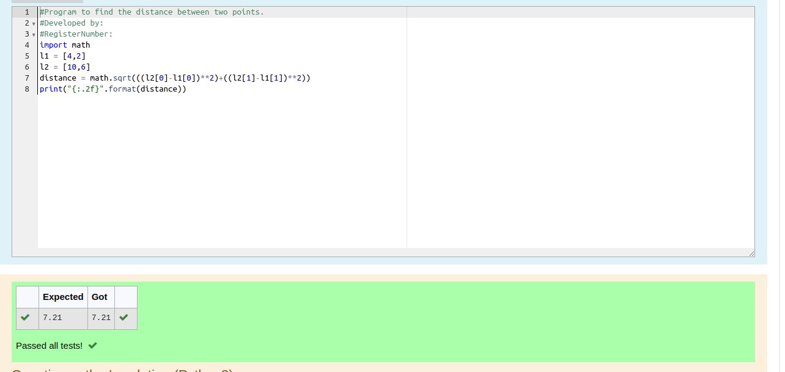

# DISTANCE-BETWEEN-TWO-POINTS

## AIM:
To write a python program to find the distance two 2 points
## ALGORITHM:
### Step 1: 
Program to find the distance between two points.
### Step 2: 
import math
### Step 3: 
list the input values
Substitute the values in the distance formula  
### Step 4: 
using formula find distance
### Step 5: 
print the result
### PROGRAM:
```python
#Program to find the distance between two points.
#Developed by: `kavya
#RegisterNumber:22008613

import math
l1 = [4,2]
l2 = [10,6]
distance = math.sqrt(((l2[0]-l1[0])**2)+((l2[1]-l1[1])**2))
print("{:.2f}".format(distance))
```


### OUTPUT:


### RESULT:
The distance between two points are successfully found by python programing
